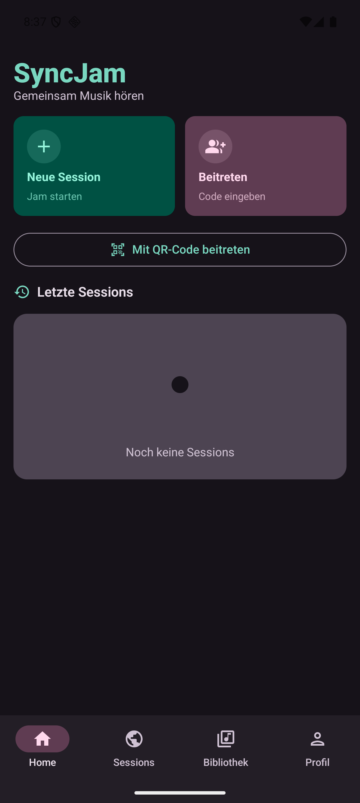
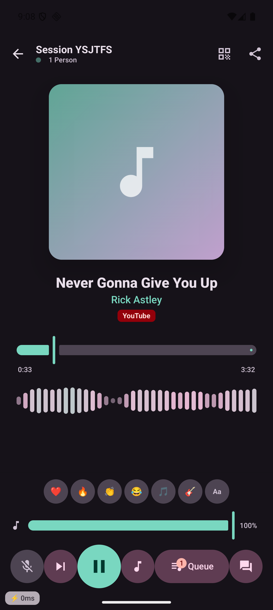
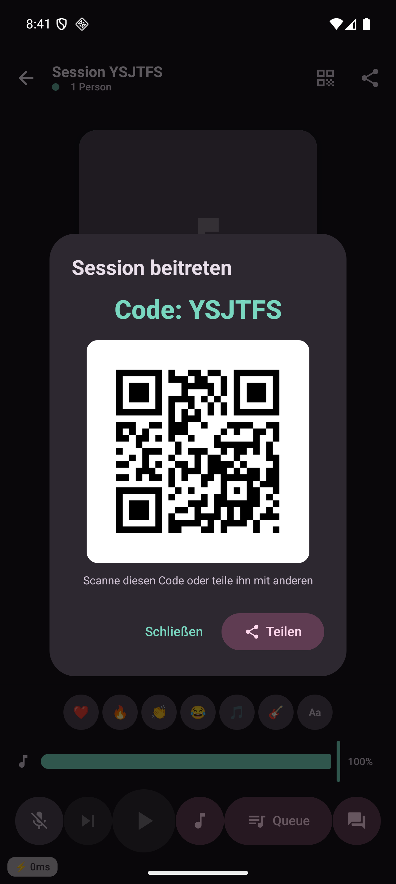
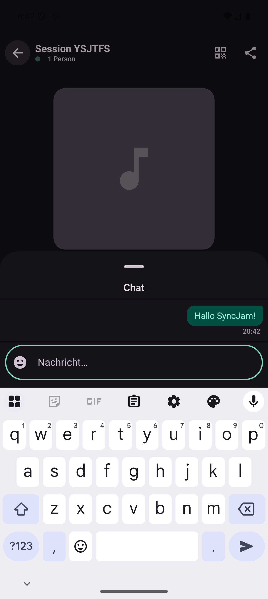
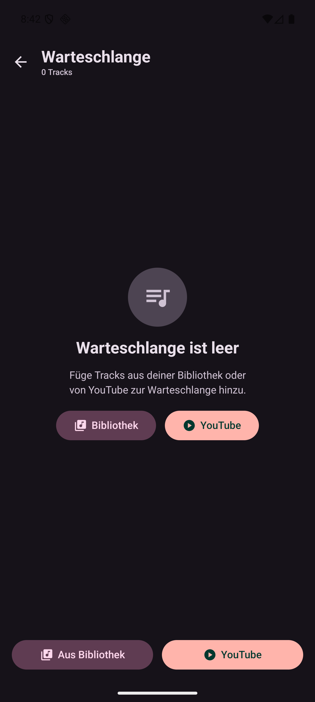
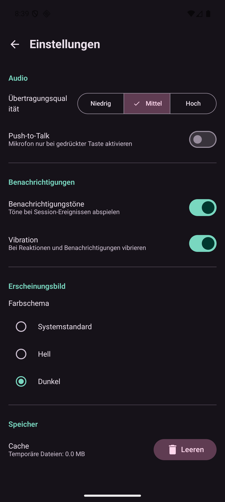
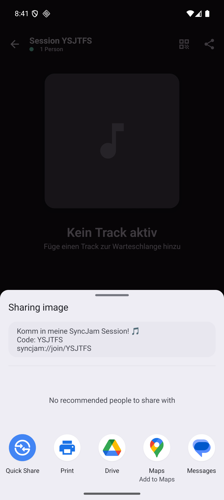
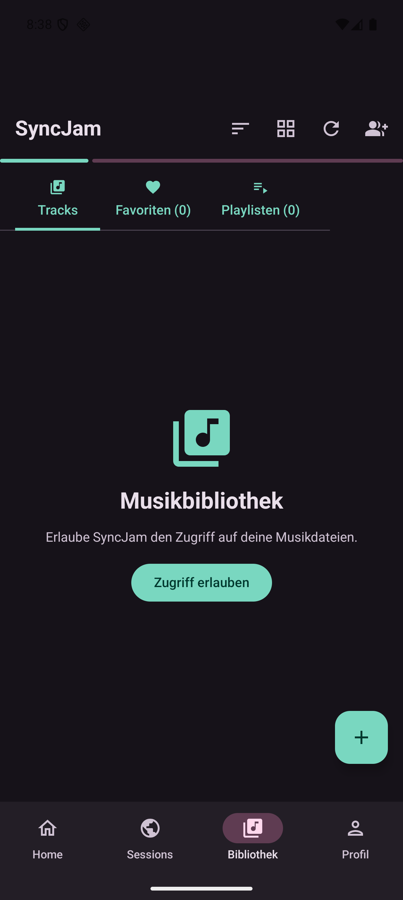

<div align="center">


# SyncJam

**Gemeinsam Musik hören — synchronisiert, sozial, kostenlos.**

Zwei oder mehr Personen hören dieselbe Musik zur selben Zeit — egal wo sie sind.
Kein Audio-Streaming, kein Abo, kein DRM. Nur deine lokalen Dateien und YouTube.

[](https://github.com/Pcf1337-hash/SyncJam/releases/latest)
[](https://github.com/Pcf1337-hash/SyncJam/releases/latest)
[](https://kotlinlang.org)
[](LICENSE)

</div>

---

## Screenshots

<div align="center">
<table>
  <tr>
    <td align="center"><br/><sub>Home</sub></td>
    <td align="center"><br/><sub>Session & Player</sub></td>
    <td align="center"><br/><sub>QR-Code Invite</sub></td>
    <td align="center"><br/><sub>Chat</sub></td>
  </tr>
  <tr>
    <td align="center"><br/><sub>Warteschlange</sub></td>
    <td align="center"><br/><sub>Einstellungen</sub></td>
    <td align="center"><br/><sub>Session teilen</sub></td>
    <td align="center"><br/><sub>Bibliothek</sub></td>
  </tr>
</table>
</div>

---

## Was ist SyncJam?

SyncJam ist eine **Android-App für synchronisiertes gemeinsames Musik hören**. Das Prinzip ist simpel:

> Jedes Gerät spielt Audio **lokal** ab. Ein zentraler Server koordiniert nur **WAS** und **WANN** gespielt wird — kein Audio-Restreaming, keine Latenzen durch Netzwerkpuffer, kein DRM-Problem.

Tracks aus der lokalen Bibliothek (MP3, FLAC, WAV, OGG, AAC, M4A, OPUS) oder direkt von **YouTube** — und alle in der Session hören exakt dasselbe, zur selben Zeit.

---

## Features

### 🎵 Wiedergabe & Synchronisation
- **NTP-basierte Uhrsynchronisation** beim Session-Beitritt (5 Samples, Minimum-RTT)
- **Drei-Stufen Drift-Korrektur**: Playback-Rate (< 500 ms) → Seek (< 2 s) → Full Resync (> 2 s)
- **YouTube-Integration** via yt-dlp: Link einfügen → Server lädt herunter → alle streamen
- **Unterstützte Formate:** MP3, FLAC, WAV, OGG, AAC, M4A, OPUS
- **Exponentieller Reconnect-Backoff** (2s → 4s → 8s → max. 30s)

### 🎨 Player
- **Vollbild-Player** mit rotierender Vinyl-Scheibe und Marquee-Titel
- **Dynamic Album Art Theming** — dominante Farbe des Covers wird als UI-Seed verwendet
- **Waveform-Visualizer** mit Echtzeit-Amplitudenanzeige
- **Mini-Player-Bar** mit Fortschrittsanzeige
- **Swipe-Down** zum Schließen, haptisches Feedback bei Steuerbefehlen
- **Glassmorphism-Overlays** (API 31+: echter Blur, Fallback semi-transparent)

### 👥 Sessions
- **Session erstellen** mit optionalem Namen, Passwort und Auto-Lösch-Timer
- **QR-Code Invite** — scannen oder als Bild teilen (inkl. Deep-Link)
- **Clipboard-Erkennung** — liegt ein Code in der Zwischenablage, fragt die App automatisch nach
- **Session-Timer** zeigt, wie lange die aktuelle Session läuft
- **Host-Krone** — visuell erkennbar, wer die Session leitet
- **Admin-Übertragung** wenn der Host die Session verlässt

### 📚 Bibliothek
- **MediaStore-Scanner** liest alle lokalen Tracks ein
- **Grid / Listen-Ansicht** — umschaltbar mit AnimatedContent
- **Sortierung** nach Titel, Interpret, Album, Dauer, Hinzugefügt
- **Playlists & Favoriten** — erstellen, bearbeiten, direkt in Sessions nutzen
- **Shimmer-Ladeanimation** während der Scanner läuft

### 🗳️ Kollaborative Queue
- **Tracks hinzufügen** aus Bibliothek, Playlists oder YouTube
- **Voting (+/−)** — Score-basierte Sortierung, gespielte Tracks bleiben unveränderlich
- **Track-Bestätigung** — Nicht-Hosts brauchen Host-Freigabe
- **Track entfernen** (Host / Admin)

### 🎙️ Voice Chat
- **LiveKit WebRTC** — Ende-zu-Ende-verschlüsselte Audioübertragung
- **Push-to-Talk-Modus** (in Einstellungen aktivierbar)
- **Music Ducking** — Musik auf 25 % wenn Mikro aktiv
- **Speaking-Indikator** mit pulsierendem Avatar-Ring
- **Netzwerkqualitäts-Anzeige** (Excellent / Good / Poor / Lost)

### 💬 Soziale Features
- **Floating Emoji-Reaktionen** — animiert mit Y-Translation + Alpha-Fade, bis zu 20 gleichzeitig
- **Ephemerer Chat** — Nachrichten verschwinden nach Session-Ende
- **Double-Tap Burst** — 5 Emojis auf einmal

### 🛡️ Admin-Tools (Host)
- **Kick / Ban** — Teilnehmer entfernen oder dauerhaft sperren
- **Server-Mute** — Mikrofon eines Teilnehmers remote deaktivieren
- **Direktnachricht** — private Nachricht an Teilnehmer

### ⚙️ Einstellungen
- Übertragungsqualität (Niedrig / Mittel / Hoch)
- Benachrichtigungstöne & Vibration
- Farbschema (System / Hell / Dunkel)
- Cache leeren

---

## Wie die Synchronisation funktioniert

### Command-Relay-Prinzip

```
Host                    Server                  Gast
  │── AddToQueue ──────►│                         │
  │◄── PlaylistUpdate ──│── PlaylistUpdate ───────►│
  │                     │                         │
  │── Play(trackId) ───►│── Play(trackId) ────────►│
  │                     │                         │
  │── TrackEnded ──────►│── Play(nextTrack) ──────►│
```

Kein Audio wird übertragen — nur Kommandos. Jedes Gerät spielt seinen Track lokal ab.

### NTP Clock-Sync

```
Client          Server
  │─── T1 ─────►│ T2
  │             │ T3
  │◄─ T2,T3 ───│ T4

RTT    = (T4 − T1) − (T3 − T2)
Offset = [(T2 − T1) + (T3 − T4)] / 2
```

5 Samples beim Join, Minimum-RTT gewinnt. Alle 30 Sekunden automatischer Refresh.

### Drift-Korrektur

| Drift | Aktion |
|:---:|:---|
| < 150 ms | Keine Korrektur |
| 150–500 ms | Playback-Rate ±2 % (unhörbar) |
| 500–2000 ms | Seek-Korrektur |
| > 2000 ms | Full Resync via StateSnapshot |

---

## Installation

### APK direkt installieren

1. Lade `app-release.apk` aus dem [neuesten Release](../../releases/latest) herunter
2. Aktiviere **"Unbekannte Quellen"** auf deinem Gerät (Einstellungen → Sicherheit)
3. Installiere die APK
4. Der öffentliche Server läuft bereits — **einfach Session erstellen und loslegen**

### Build from Source

```bash
git clone https://github.com/Pcf1337-hash/SyncJam.git
cd SyncJam
./gradlew :app:assembleDebug
# APK: app/build/outputs/apk/debug/app-debug.apk
```

**Voraussetzungen:** JDK 17+, Android SDK 35

---

## Server

Der Sync-Server ist ein **Ktor-WebSocket-Server** mit yt-dlp-Integration, der in Docker läuft.

Der öffentliche Server ist bereits aktiv — du musst nichts selbst hosten.

### Selbst hosten

```bash
# JAR bauen
./gradlew :server:shadowJar

# Docker Compose starten
cd server
docker compose up -d
```

### Umgebungsvariablen

| Variable | Beschreibung | Standard |
|:---|:---|:---|
| `PORT` | Server-Port | `8080` |
| `SUPABASE_URL` | Supabase Projekt-URL | — |
| `SUPABASE_KEY` | Supabase Service-Role-Key | — |
| `LIVEKIT_API_KEY` | LiveKit API Key | — |
| `LIVEKIT_API_SECRET` | LiveKit Secret | — |
| `LIVEKIT_WS_URL` | LiveKit WebSocket URL | — |
| `YTDLP_COOKIES_PATH` | Pfad zu cookies.txt (geo-gesperrt) | — |

### API-Übersicht

| Methode | Pfad | Beschreibung |
|:---|:---|:---|
| `GET` | `/health` | Server-Status |
| `GET` | `/time` | Server-Zeit für NTP-Sync |
| `POST` | `/session` | Session erstellen |
| `GET` | `/session/{code}` | Session-Info |
| `DELETE` | `/session/{code}` | Session löschen (nur Host) |
| `GET` | `/sessions/public` | Öffentliche Sessions |
| `POST` | `/upload/{code}` | Track hochladen |
| `POST` | `/youtube/add` | YouTube-Track hinzufügen |
| `GET` | `/youtube/stream/{id}` | YouTube-Track streamen |
| `WS` | `/ws/session/{code}` | Haupt-Sync WebSocket |
| `WS` | `/ws/ntp` | NTP Clock-Sync |

---

## Tech Stack

<div align="center">

| Komponente | Technologie | Version |
|:---|:---|:---:|
| Sprache | Kotlin | 2.2.0 |
| UI Framework | Jetpack Compose + Material 3 | BOM 2025.05 |
| Audio | AndroidX Media3 / ExoPlayer | 1.9.0 |
| Dependency Injection | Hilt | 2.58 |
| Navigation | Navigation Compose (Type-Safe) | 2.8.9 |
| Datenbank | Room + KSP | 2.7.1 |
| Netzwerk | Ktor Client | 3.1.3 |
| WebSocket | Ktor Client WebSocket | 3.1.3 |
| Voice Chat | LiveKit Android SDK | 2.23.5 |
| Bilder | Coil 3 | 3.1.0 |
| Animationen | Lottie Compose | 6.6.6 |
| Dynamic Theming | MaterialKolor | 2.0.0 |
| QR-Code | ZXing Android Embedded | 4.3.0 |
| Persistenz | DataStore Preferences | 1.1.4 |
| Server | Ktor Server | 3.1.3 |
| YouTube | yt-dlp | latest |
| Min SDK | Android 8.0 (API 26) | — |
| Target SDK | Android 15 (API 35) | — |

</div>

---

## Changelog

### v2.8.0
- Fix: CoverArtDownloader-Endlosschleife bei leerer Bibliothek behoben
- Fix: YouTube Download-Banner zeigt jetzt korrekten Titel statt roher Video-ID
- QR-Code Teilen: QR-Bild wird jetzt als PNG in den Android Share-Sheet mitgegeben
- QR-Code: Teilen-Button direkt im QR-Dialog

### v2.7.0 (v2.6.0)
- QR-Scanner zum Beitreten einer Session
- Library Carousel (zuletzt gespielt / meistgespielt)
- Tablet-Layout mit WindowSizeClass
- Queue Drag-Reorder (Host)
- Debug-Overlay (Latenz-Anzeige)

### v2.5.0
- YouTube Bot-Fix (Cookie-Support)
- Album Art Sync verbessert
- Node.js Runtime auf Server

### v2.4.0
- Security Hardening
- Thread Safety fixes
- Sync-Stabilität verbessert

<details>
<summary>Ältere Versionen</summary>

### v2.3.x
- Non-Host Audio Fix
- Queue-Stabilität
- Track-Bestätigung durch Host
- Race Conditions behoben
- Reconnect Backoff

### v2.2.0
- Audio Focus beim Session-Beitritt
- VoiceOverlay als floating Avatar

### v2.1.0
- In-Session Bibliothek
- Admin-Rechte
- Session-Verlauf

</details>

---

## Lizenz

```
MIT License — Copyright (c) 2025 Pcf1337-hash
```

Freie Nutzung, Modifikation und Weitergabe erlaubt. Kein Gewährleistungsanspruch.

---

<div align="center">

Made with ❤️ and Kotlin · [Releases](../../releases) · [Issues](../../issues)

</div>
